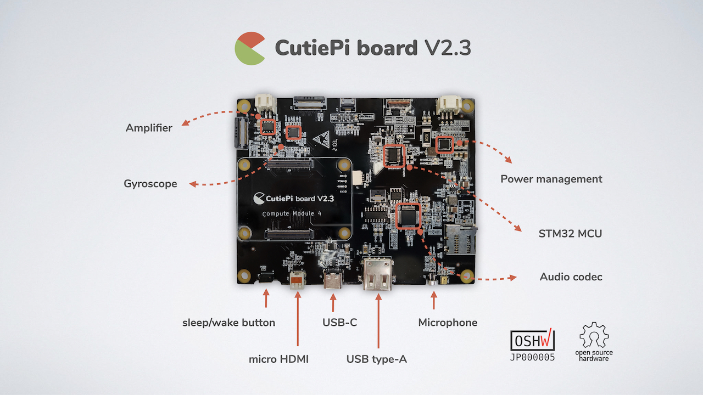

# CutiePi board V2.3

This repository provides a custom carrier board designed for the open source CutiePi tablet project, to make use of the Raspberry Pi Compute Module 4.

 

## Contents

- Cadence OrCAD Schematic [CutiePi_V2.3-20210409.DSN](CutiePi_V2.3-20210409.DSN)
- Cadence OrCAD/Allegro PCB file [CutiePi_V2_3.brd](CutiePi_V2_3_TapeOut/CutiePi_V2_3_PCB/CutiePi_V2_3.brd)
- Bill of Materials [CutiePi_V2.3_BOM-20210802.xlsx](CutiePi_V2.3_BOM-20210802.xlsx)
- PDF of schematic [CutiePi_V2.3_schematic-20210414.pdf](CutiePi_V2.3_schematic-20210414.pdf)

## Copyright and License
Copyright (c) 2021 Zhang "Iron Pillar" Hogan. All rights reserved.

Part of CutiePi board's design is based on Pi Foundation's 
[Compute Module 4 IO Board](https://github.com/raspberrypi/documentation/blob/master/hardware/computemodule/designfiles.md), and we are releasing it under the same [modified BSD license](LICENSE.txt). 

All documentation is licensed under a Creative Commons BY-SA 4.0 international license.